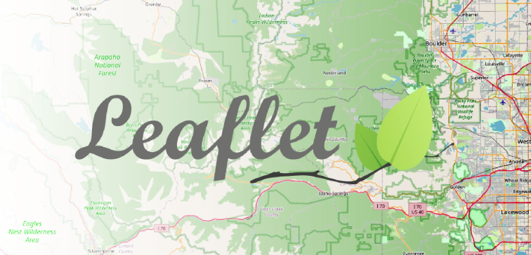

# Leaflet Challenge

Leaflet Code - https://github.com/MichaelELeonard/Leaflet-Challenge/blob/main/Leaflet/static/js/logic.js

## THE BACKGROUND
The United States Geological Survey, or USGS for short, is responsible for providing scientific data about natural hazards, the health of our ecosystems and environment, and the impacts of climate and land-use change. Their scientists develop new methods and tools to supply timely, relevant, and useful information about the Earth and its processes.
The USGS is interested in building a new set of tools that will allow them to visualize their earthquake data. They collect a massive amount of data from all over the world each day, but they lack a meaningful way of displaying it. In this challenge, you have been tasked with developing a way to visualize USGS data that will allow them to better educate the public and other government organizations (and hopefully secure more funding) on issues facing our planet.

## THE GOAL

The USGS provides earthquake data in several different formats, updated every 5 minutes. Visit the USGS GeoJSON FeedLinks to an external site and retrieve the dataset from the Past 7 Days, you will be given a JSON representation of that data. Use the URL of this JSON to pull in the data for the visualization. 

USGS GeoJSON FeedLinks - https://earthquake.usgs.gov/earthquakes/feed/v1.0/geojson.php

Import and visualize the data by doing the following:
Using Leaflet, create a map that plots all the earthquakes from your dataset based on their longitude and latitude.
* Your data markers should reflect the magnitude of the earthquake by their size and the depth of the earthquake by color. Earthquakes with higher magnitudes should appear larger, and earthquakes with greater depth should appear darker in color.
* Include popups that provide additional information about the earthquake when its associated marker is clicked.
* Create a legend that will provide context for your map data.

